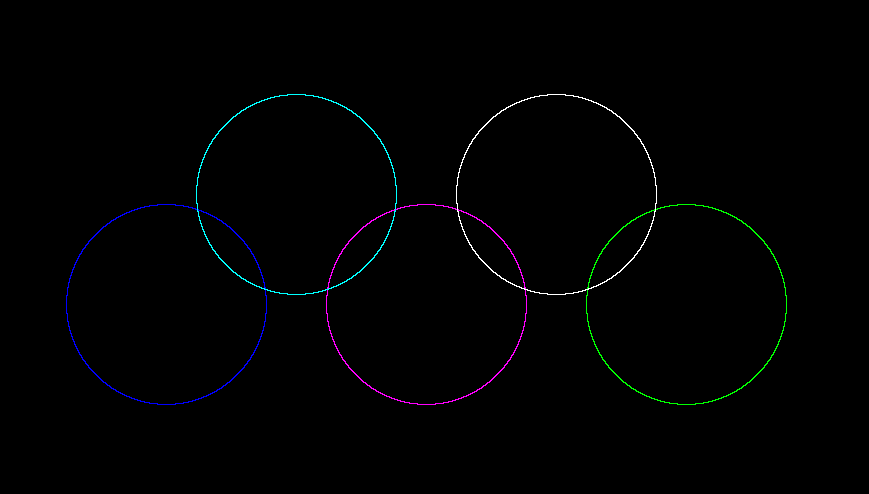
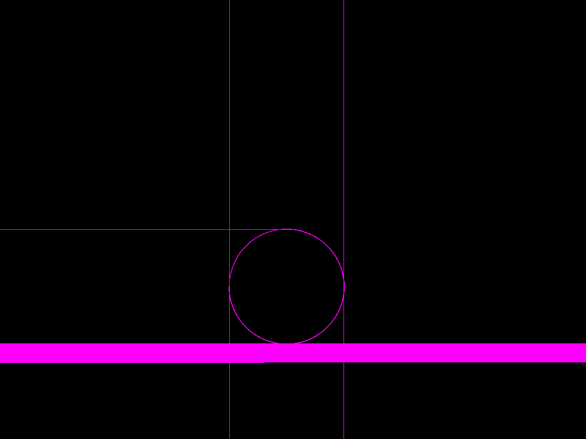
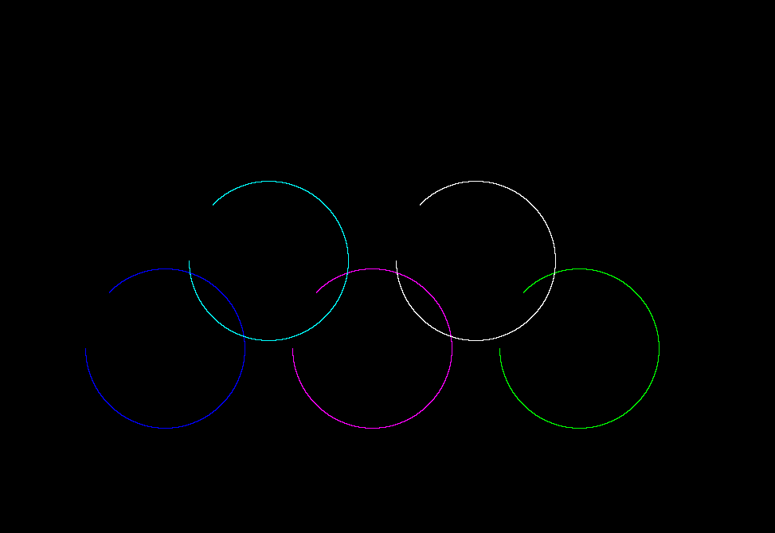
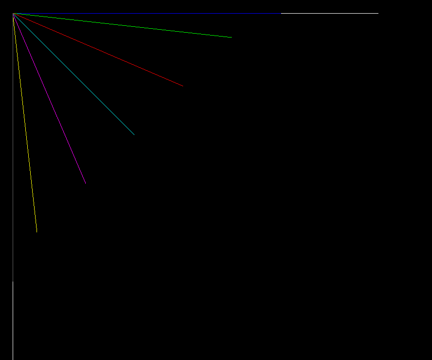
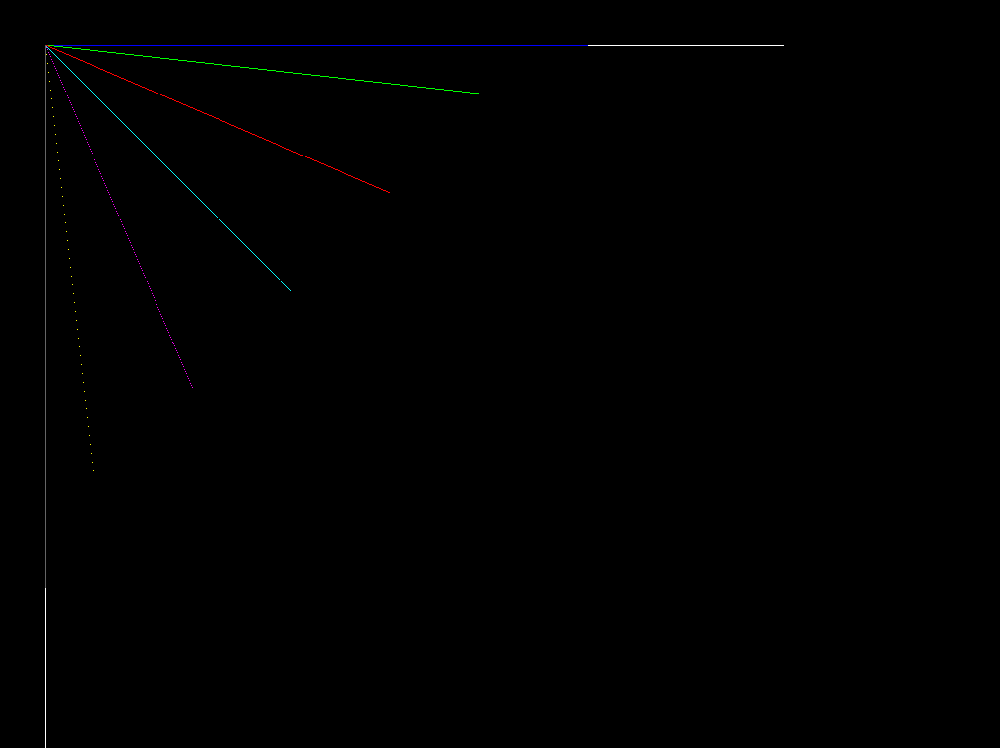
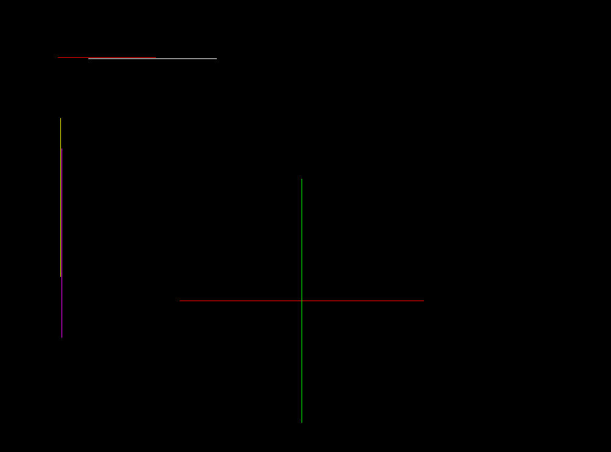

# TUGUI
a tiny uefi graphical user interfaces libaray......

## 1.最近动态

> 优化目录结构
>
> 添加基础的圆算法

## 2.功能展示

> 4.画圆
>
> 3.任意角度直线
>
> 2.坐标线
>
> 1.像素控制

### 画圆

#### 5环示例

#### bug圆

### 任意角度直线

#### 任意角度直线算法优化

#### 任意角度直线

#### 坐标线

## 3.开发环境

- 编译器: x86_64-w64-mingw32-g++
- 编译工具: make
- 编辑工具: vs code
- 测试机器: VirtualBox 虚拟机
- 存储器: U盘
- other:
  - mount/umount
  - fdisk
  - mkfs.vfat