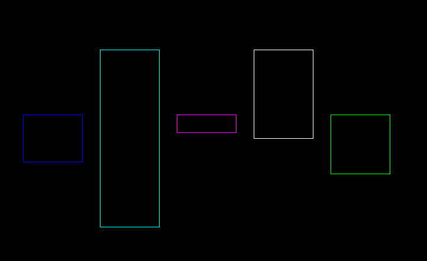
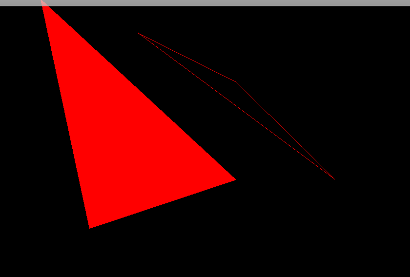

## 功能展示

> 5.画矩形
>
> 4.画圆
>
> 3.任意角度直线
>
> 2.坐标线
>
> 1.像素控制

### 画矩形 [sourceCode](../test/rectangle/test_rectangle.cpp)

### 画圆

#### 5环示例  [sourceCode](../test/circle/test_circle.cpp)

#### bug圆

### 任意角度直线 

#### 任意角度直线算法优化 [sourceCode](../test/straight_line/test_straight_line.cpp)

#### 任意角度直线

#### 坐标线 [sourceCode](../test/coordinate_line/test_coordinate_line.cpp)

#### 三角形 [sourceCode](../test/coordinate_line/test_triangle.cpp)

