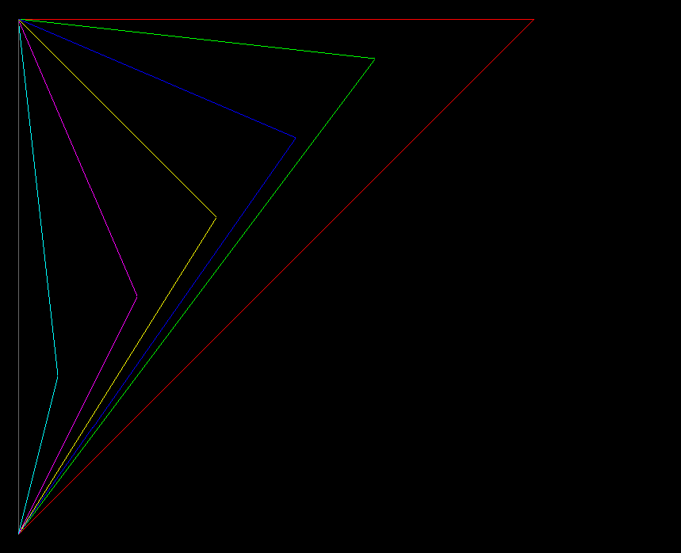

## 功能展示

> 图形变换
>
> - scale/缩放

> 基础图形
>
> - 三角形
>
> - 画矩形
>
> - 画圆
>
> - 任意角度直线
>
> - 坐标线
>
> - 像素控制

### Scale / 缩放 [sourceCode](../test/affineTransform/test_scale.cpp)

### 三角形 [sourceCode](../test/coordinate_line/test_triangle.cpp)

### 画矩形 [sourceCode](../test/rectangle/test_rectangle.cpp)

### 画圆 [sourceCode](../test/circle/test_circle.cpp)

#### 5环示例

#### bug圆

### 任意角度直线 [sourceCode](../test/straight_line/test_straight_line.cpp)

#### 任意角度直线算法优化 

#### 任意角度直线

### 坐标线 [sourceCode](../test/coordinate_line/test_coordinate_line.cpp)

